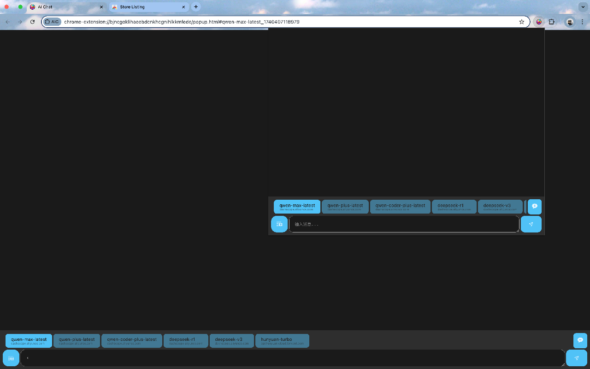

  <h1>🤖 AIC - AI Conversation Assistant</h1>
  
Smart Chat | Multi-Platform | History Memory 

## ✨ Core Features
- **OpenAPI Compatibility**  
  Supports OpenAI-API compatible api services (DeepSeek/ChatGPT/etc)
- **Conversation Memory**  
  Auto-saves complete chat history with context-aware interactions
- **Multi-Provider Management**  
  Manage API keys and endpoints for different service providers
- **Smart Model Switching**  
  Freely choose between AI models (GPT-3.5/Deepseek-r1/Hunyuan etc)
- **Privacy First**  
  All data stored locally, never uploaded to cloud

## 🛠️ Installation
1. Download latest release (ZIP package)
2. Visit `chrome://extensions`
3. Enable "Developer mode" (top-right)
4. Click "Load unpacked" and select extension folder

## 🎮 Usage Guide
1. Click extension icon to open dashboard
2. Add API configurations under "Settings"
3. Select desired AI model
4. Start chatting! History auto-saves in sidebar

## 📷 Screenshot

